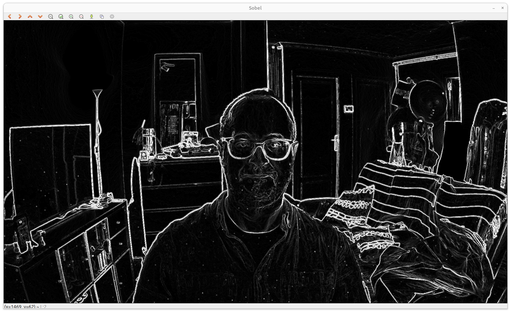
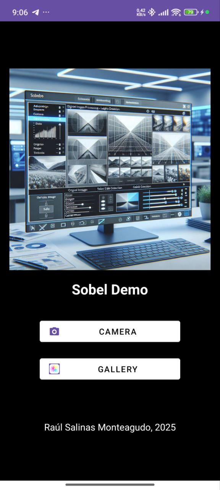
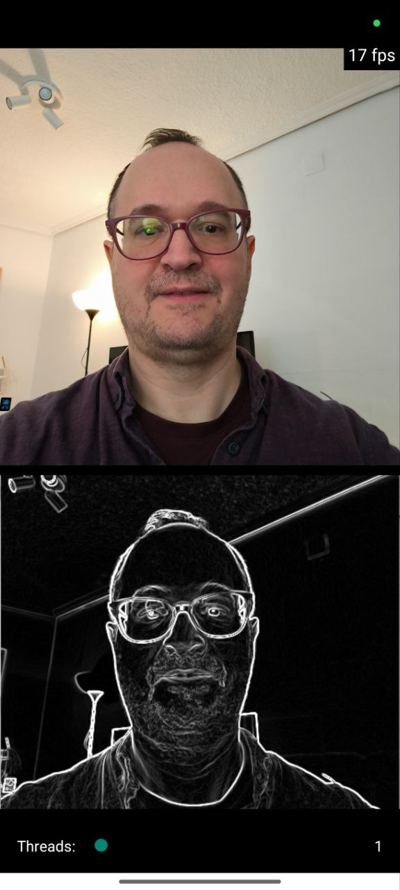
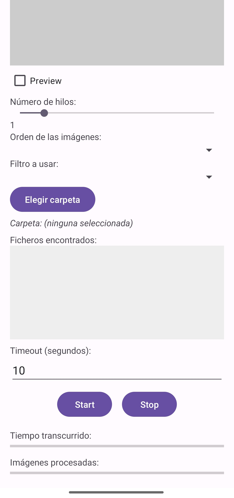

# Sobel-Demo

A C++ implementation of the Sobel image filter for both Linux and Android.

# Overview

This project provides two tools that implement the Sobel filter for edge detection in images, available for both PC and Android platforms, sharing common code through JNI (Java Native Interface).

# **Project Structure**

The file organization is as follows (standard files omitted for the sake of brevity):

## **Configuration Files**
- **[.gitignore](.gitignore)** – Specifies files and folders to be ignored in version control.
- **[.travis.yml](.travis.yml)** – Configuration for Travis CI continuous integration.
- **[Dockerfile](Dockerfile)** – A Docker configuration to build the Linux version.
- **[Dockerfile-Android](Dockerfile-Android)** – A Docker configuration to build the Android version.
- **[docker-compose.yml](docker-compose.yml)** – Easily starts the camera mode on Linux.

## **Scripts**
- **[build.sh](build.sh)** – Script to compile the Linux variant of the project.

## **android/ Directory – Android Implementation**
- **[prepare.sh](android/prepare.sh)** – Setup script for the Android environment (downloads OpenCV module).
- **android/app/src/main/java/es/rausamon/sobeldemo/**  
  Contains the application logic in Java:
  - **[MainActivity.java](android/app/src/main/java/es/rausamon/sobeldemo/MainActivity.java)** – Main screen.
  - **[CameraActivity.java](android/app/src/main/java/es/rausamon/sobeldemo/CameraActivity.java)** – Captures images using the camera.
  - **[GalleryActivity.java](android/app/src/main/java/es/rausamon/sobeldemo/GalleryActivity.java)** – Allows image selection from the gallery.
  - **[JNIHelper.java](android/app/src/main/java/es/rausamon/sobeldemo/JNIHelper.java)** – Interface for communication with native C++ code.

- **android/app/src/main/cpp/**  
  Native C++ code for image processing:
  - **[native-lib.cpp](android/app/src/main/cpp/native-lib.cpp)** – Sobel filter stubs to access the Sobel library. Only the bridging between the Java and the C++ worlds is addressed here.

- **android/app/**
  - **[CMakeLists.txt](android/app/CMakeLists.txt)** – Build configuration for native code used from Android.

## **common/ Directory – Shared Code Between Platforms**
- **[sobel.cpp](common/sobel.cpp)** – Generic Sobel algorithm implementation.
- **[sobel.h](common/sobel.h)** – Function definitions for the algorithm.

## **linux/ Directory – Linux Implementation**
- **[sobelgui.cpp](linux/sobelgui.cpp)** – GUI application for applying the Sobel filter to images.
- **[test_sobelgui.cpp](linux/test_sobelgui.cpp)** – Unit tests for the Linux code.
- **[CMakeLists.txt](linux/CMakeLists.txt)** – CMake build configuration.
- **[check-leaks.sh](linux/check-leaks.sh)** – Script for detecting memory leaks using Valgrind.

## **testdata/ Directory – Test Data**
- **[lena.jpg](testdata/lena.jpg)** – Classic test image for image processing.

# Design

The goal was to create a project where a single C++ implementation of an example filter (in this case, the classical Sobel filter) could be efficiently reused across different platforms.

The first decision was to establish the interface for the filter. Initially, a pure-C++, OpenCV-agnostic interface was used (with `uchar` arrays), but I decided to use OpenCV for several reasons:

1. OpenCV had been already proposed in the problem statement.
2. OpenCV offers unmatched performance.
3. OpenCV's license is extremely permissive.

With this in mind, these are the function prototypes provided under `common/`:

```cpp
void sobelSetThreads(int n);
void sobelFilter(const cv::Mat &input, cv::Mat &output);
```

Both the desktop and Android applications share a common implementation of the Sobel filter. This is achieved using JNI, ensuring that the core filtering logic remains consistent across platforms.

# Dependencies

- OpenCV 4.11 (for Android)
- CMake
- Android NDK
- Google Test (GTest)

# Linux Version

Some simple smoke tests have been written using Google Test.

## Command-line arguments - Usage
```
$ ./build/sobelgui -h
Sobel Demo v1.0
Usage: sobelgui [params] 

        -?, -h, --help, --usage (value:true)
                print this message
        -T, --run-time (value:0)
                run time in seconds (optional)
        -c, --camera
                read from camera
        -i, --input
                set input file (optional)
        -o, --output
                set output file (optional). If not given, resulting image is shown.
        -t, --threads (value:1)
                number of threads
```

Remark that the "--run-time" feature was added in order to easily Valgrind the program.  This way we ensure that everything has been gracefully closed and hopefully liberated by the time of the `exit()`.

## Commands in camera mode:

See `SobelCameraFilterGui::HandleKey(int key)` in [sobelgui.cpp](linux/sobelgui.cpp#L204) for details.

- `q` – Exit
- `0-9` – Select the number of threads
- `s` – Save the current filtered image
- `c` – Enable/disable unprocessed preview



# Android Version

This app offers two working modes: live filtering of camera images and filtering from the gallery.

<p align="center">
  
</p>

The camera mode displays the original and processed images simultaneously.

A slider at the bottom allows the user to select the number of OpenMP threads. You can observe via `adb shell` that the process's resource consumption increases significantly when using multiple threads, though the FPS do not noticeably improve. (See the performance evaluation at the end of this document.)

Tapping on the upper half of the screen switches between the front and back cameras.

<p align="center">
  
</p>

When filtering images from the gallery, tapping on the screen switches between the original and processed images.

# Building

## Desktop Application

### Using Docker

If you don't want to install any dependencies locally, you can use Docker.

`docker build -t sobel  .` will build and test the software.

And then for example:

`docker run -t sobel --help`

### Native Build

The desktop application is built using CMake. A `build.sh` script is provided in the root directory to simplify the build and test process.

To build and test the desktop application, run:
```sh
./build.sh
```

## Android Application

The Android application requires OpenCV 4.11. Due to its large size, you need to download it separately after cloning the repository.

To prepare the Android environment, run:
```sh
android/prepare.sh
```

Then, you can open the project `android/`. For example with `studio.sh android/`. 

## Usage

### Desktop Application

#### Camera mode

Docker way: `docker compose up --build`
Native way: `sobelgui -c`

#### Single image filtering

After building the application, you can run the executable to apply the Sobel filter to an image.

Use the following command:
```sh
./sobelgui -i=<input_image> -o=<output_image>
```
The Docker image can also be used for this. You'll need to expose some directory within the Docker container (with `-v`)

*Note: OpenCV command-line parsing requires the use of equal signs.*

### Android Application

Once the Android environment is set up, you can build and install the APK on your device. The application allows you to select an image and apply the Sobel filter directly on your Android device.

# Software validation and testing

Accurate validation of the processed images is way beyond the scope of this task and would be mathematically challenging for me. 

However, basic smoke testing has been implemented: 

- An image can be filtered without errors.
- Errors while trying to write to an output image are caught and reported with a non-zero exit value instead of getting silently swallowed.
- The output image can be read back using OpenCV.

If the algorithm is deterministic, a comparison test could be added using OpenCV's well-established reference implementation to verify the accuracy of the resulting images.


```
$ ./runTests 
[==========] Running 3 tests from 1 test suite.
[----------] Global test environment set-up.
[----------] 3 tests from SobelGuiTest
[ RUN      ] SobelGuiTest.FullDeviceTest
Using 1 OpenMP threads
Error saving image: full.jpg
unlink: No such file or directory
[       OK ] SobelGuiTest.FullDeviceTest (82 ms)
[ RUN      ] SobelGuiTest.HelpOption
[       OK ] SobelGuiTest.HelpOption (59 ms)
[ RUN      ] SobelGuiTest.OutputFileTest
Using 1 OpenMP threads
Sobel image saved as: output.jpg
[       OK ] SobelGuiTest.OutputFileTest (100 ms)
[----------] 3 tests from SobelGuiTest (243 ms total)

[----------] Global test environment tear-down
[==========] 3 tests from 1 test suite ran. (243 ms total)
[  PASSED  ] 3 tests.
```

# Thoughts on Performance

Unfortunately, we did not observe a significant benefit from using multiple threads in this program.  The speedup is very low.

This is likely because convolution is not computationally heavy compared to the surrounding operations (e.g., acquiring and transforming images).

# Future/Possible Work

- Add the option `--frames` to the Linux CLI for processing just one (or more) camera images for profiling/Valgrind.
- Add a benchmarking option to both the Linux and Android versions.

The Android version could read from the DCIM images in the internal storage, enabling us to see the impact of different implementation details (e.g., using threads or other parallelization mechanisms).

<p align="center">

</p>